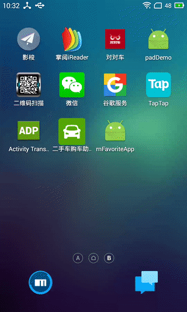

> 本app主要是实现记录个人爱好，并展示使用rn的app所能实现的交互。


## 依赖的第三方库
### redux部分
### 路由部分

## 项目目录
+ app/
  +     ​
  +     /assets/       //资源目录
  +     /core/         //核心类目录  
  +     /components/
       - /customIcons/  //自定义icon
       - /tabBarIcon    //icon封装的tabBarIcon
  +     /pages/           //页面目录
       + /thems/           //主题配置文件目录
       + /vendor/          //需要修改的第三方page目录
       + /widgets/         //工具组件目录

## 更新日志
### 2017/4/24 
#### 版本升级：从`0.39.2` 升级到`0.43`

1.安装git

2.执行`npm update -g react-native-cli  `安装react-native-git-upgrade工具模块

3.运行更新命令

```
$ react-native-git-upgrade
# 这样会直接把react native升级到最新版本

# 或者是：

$ react-native-git-upgrade X.Y.Z
# 这样把react native升级到指定的X.Y.Z版本

```
4.运行`react-native -version`来查看是不是最新版本
#### 测试可回收组件`FlatList`


### 2017/01/05

使用`react-native-vector-icons`的`createIconSet`函数自定义icon。
整理项目目录。


